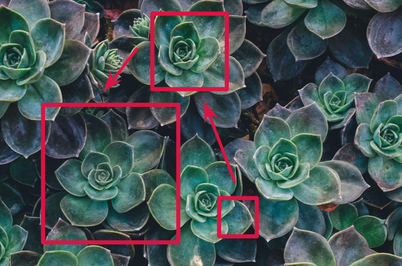
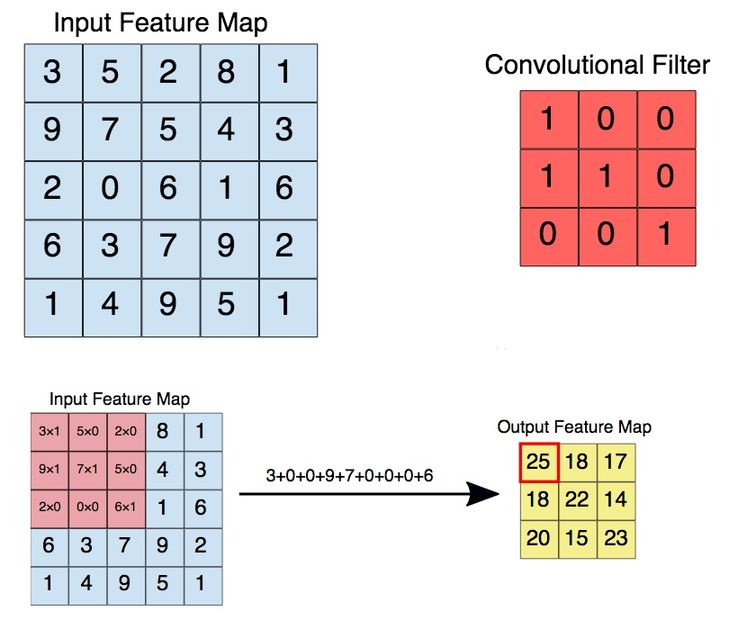
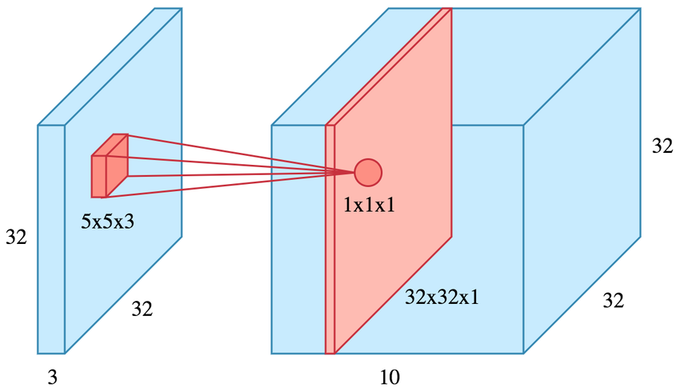
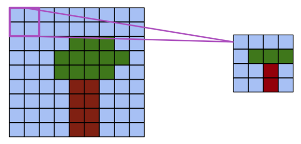
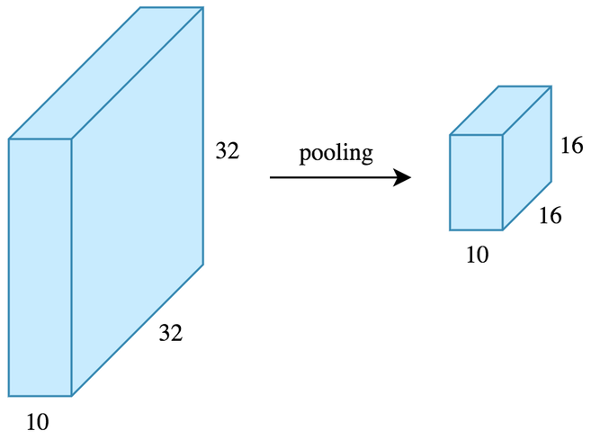
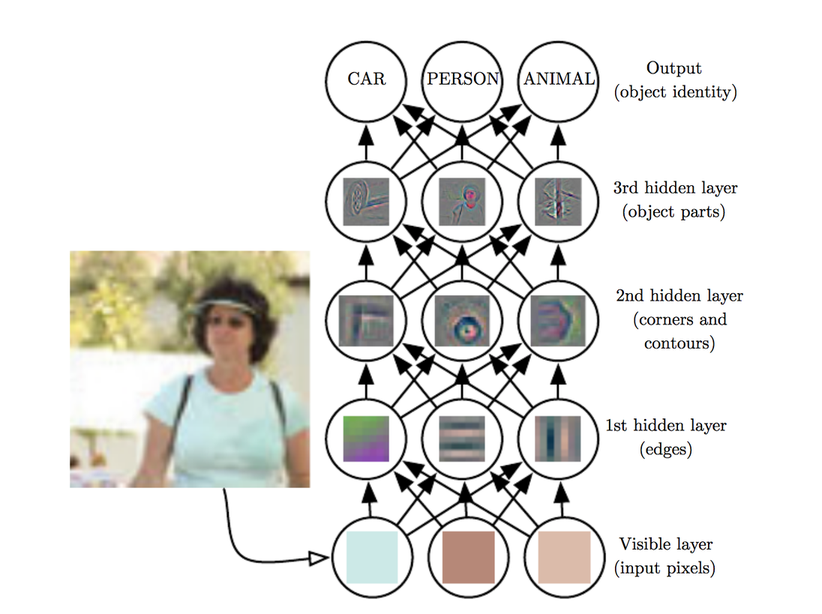
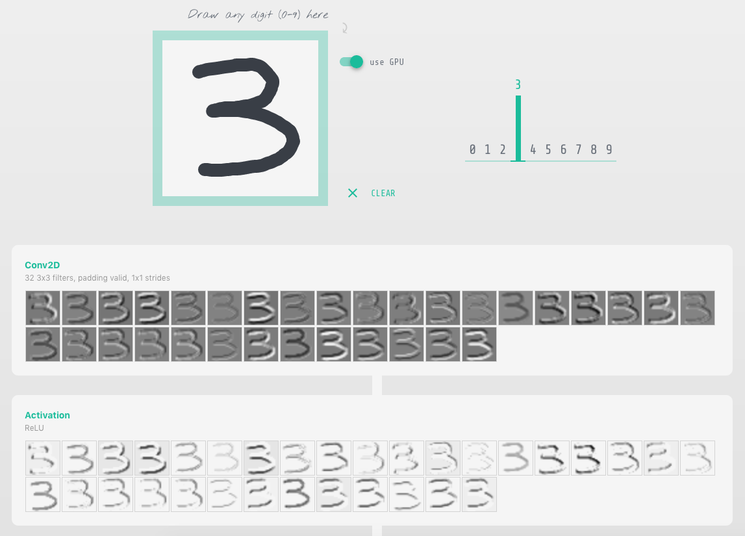
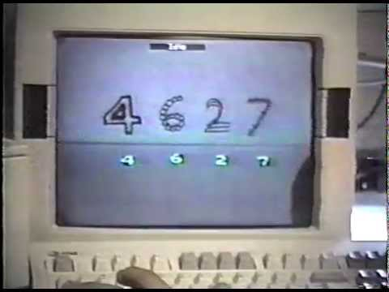
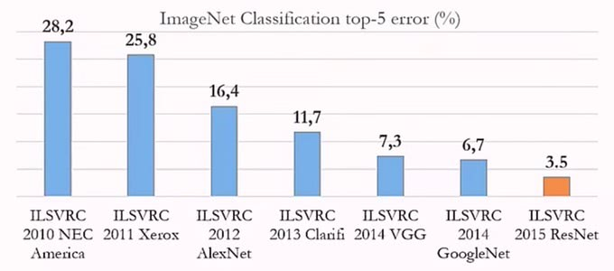
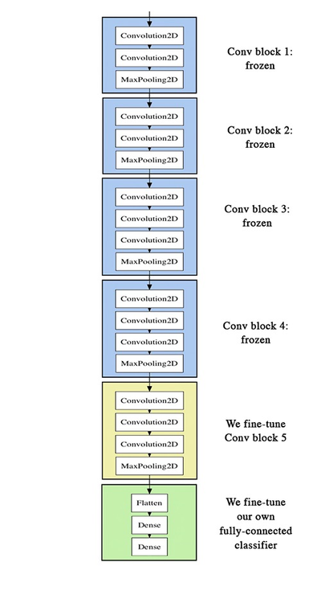

<!-- Apply header and footer to first slide only -->
<!-- _header: "" -->
<!-- _footer: "[Baptiste Pesquet](https://www.bpesquet.fr)" -->

# Convolutional Neural Networks

<!-- Show pagination, starting with second slide -->
<!-- paginate: true -->

---

## Learning objectives

- Discover the general architecture of convolutional neural networks.
- Understand why they perform better than plain neural networks for image-related tasks.

---

## Architecture

---

### Justification

The visual world has the following properties:

- Translation invariance.
- Locality: nearby pixels are more strongly correlated
- Spatial hierarchy: complex and abstract concepts are composed from simple, local elements.
- 小元素组成大元素

Classical models are not designed to detect local patterns in images.

---

---

### General CNN design

---

### The convolution operation

Apply a **kernel** to data. Result is called a **feature map**.

---

---

### Convolution parameters

- **Filter dimensions**: 2D for images.
- **Filter size**: generally 3x3 or 5x5.
- **Number of filters**: determine the number of feature maps created by the convolution operation.
- **Stride**: step for sliding the convolution window. Generally equal to 1.
- **Padding**: blank rows/columns with all-zero values added on sides of the input feature map.

---

### Preserving output dimensions with padding

---

#### Valid padding

Output size = input size - kernel size + 1

---

#### Full padding

Output size = input size + kernel size - 1

---

#### Same padding

Output size = input size

---

### Convolutions inputs and outputs

---

### 2D convolutions on 3D tensors

- Convolution input data is 3-dimensional: images with height, width and color channels, or features maps produced by previous layers.
- Each convolution filter is a collection of *kernels* with distinct weights, one for every input channel.
- At each location, every input channel is convolved with the corresponding kernel. The results are summed to compute the (scalar) filter output for the location.
- Sliding one filter over the input data produces a 2D output feature map.

---

---

---

### Activation function

- Applied to the (scalar) convolution result.
- Introduces non-linearity in the model.
- Standard choice: ReLU.

---

### The pooling operation

- Reduces the dimensionality of feature maps.
- Often done by selecting maximum values (*max pooling*).只取最大值，减少feature maps的大小

---

#### Pooling result

---

#### Pooling output

---

### Training process

Same principle as a dense neural network: **backpropagation** + **gradient descent**.

For convolution layers, the learned parameters are the values of the different kernels.

[Backpropagation In Convolutional Neural Networks](https://www.jefkine.com/general/2016/09/05/backpropagation-in-convolutional-neural-networks/)

---

### Interpretation

- Convolution layers act as **feature extractors**.
- Dense layers use the extracted features to classify data.

---

---

---

## History

### Humble beginnings: LeNet5 (1988)

---

---

### The breakthrough: ILSVRC

- [*ImageNet Large Scale Visual Recognition Challenge*](http://image-net.org/challenges/LSVRC/)
- Worldwide image classification challenge based on the [ImageNet](http://www.image-net.org/) dataset.

---

### AlexNet (2012)

Trained on 2 GPU for 5 to 6 days.

---

### VGG (2014)

---

### GoogLeNet/Inception (2014)

- 9 Inception modules, more than 100 layers.
- Trained on several GPU for about a week.

---

### Microsoft ResNet (2015)

- 152 layers, trained on 8 GPU for 2 to 3 weeks.
- Smaller error rate than a average human.

---

---

### Depth: challenges and solutions

- Challenges
  - Computational complexity
  - Optimization difficulties

- Solutions
  - Careful initialization
  - Sophisticated optimizers
  - Normalisation layers
  - Network design

---

## Using a pretrained network

---

### An efficient strategy

A *pretrained* convnet is a saved network that was previously trained on a large dataset (typically on a large-scale image classification task). If the training set was general enough, it can act as a generic model and its learned features can be useful for many problems.

It is an example of *transfer learning*.

There are two ways to use a pretrained model: *feature extraction* and *fine-tuning*.

---

### Feature extraction

Reuse the convolution base of a pretrained model, and add a custom classifier trained from scratch on top ot if.

State-of-the-art models (VGG, ResNet, Inception...) are regularly published by top AI institutions.

### Fine-tuning

Slightly adjusts the top feature extraction layers of the model being reused, in order to make it more relevant for the new context.

These top layers and the custom classification layers on top of them are jointly trained.

---

