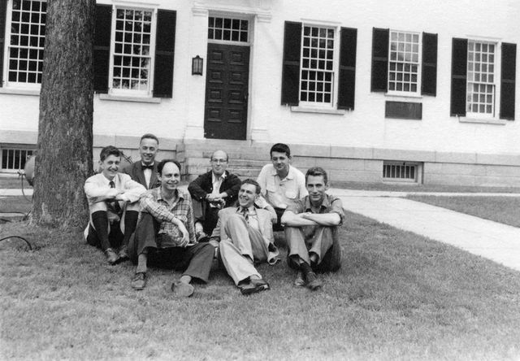
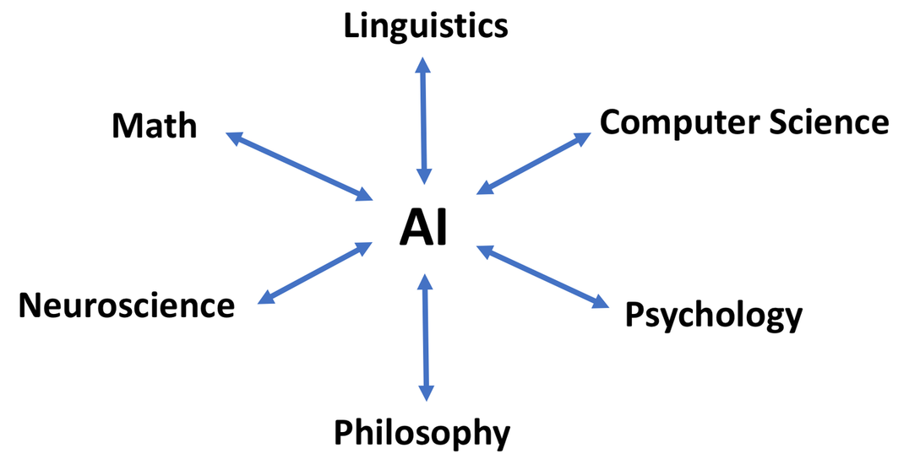

<!-- Apply header and footer to first slide only -->
<!-- _header: "" -->
<!-- _footer: "[Baptiste Pesquet](https://www.bpesquet.fr)" -->

# About Artificial Intelligence

---

<!-- Show pagination, starting with second slide -->
<!-- paginate: true -->

## A recent discipline

Attended by many brilliant minds of the era, the [1956 Dartmouth workshop on Artificial Intelligence](http://jmc.stanford.edu/articles/dartmouth/dartmouth.pdf) is widely considered the event that kicked off AI as a research discipline.

---

## The original ambition of AI

> "AI is the science and engineering of making intelligent machines." ([John McCarthy](<https://en.wikipedia.org/wiki/John_McCarthy_(computer_scientist)>))

> "Every aspect of learning or any other feature of intelligence can in principle be so precisely described that a machine can be made to simulate it." ([Dartmouth Workshop](https://en.wikipedia.org/wiki/Dartmouth_workshop), 1956)

> "AI is the science of making machines do things that would require intelligence if done by men." ([Marvin Minsky](https://en.wikipedia.org/wiki/Marvin_Minsky))

---

## What is intelligence, by the way?

The definition of [intelligence](https://en.wikipedia.org/wiki/Intelligence) is controversial, varying in what its abilities are and whether or not it is quantifiable.[$^{[1]}$](#references)

It can be described as the ability to perceive or infer information; and to retain it as knowledge to be applied to adaptive behaviors within an environment or context.[$^{[2]}$](#references)

> "Intelligence is what you use when you don't know what to do." ([Jean Piaget](https://en.wikipedia.org/wiki/Jean_Piaget))

---

## A technical definition of AI

> "AI refers to systems that **display** intelligent behavior by analysing their **environment** and taking **actions** - with some degree of **autonomy** - to achieve specific **goals**." ([European Commission](https://ec.europa.eu/newsroom/dae/document.cfm?doc_id=51625), 2018)

AI systems can be either:

- Purely **software**-based (e.g. voice assistants, search engines, face recognition systems).
- Embedded in **hardware** devices (e.g. robots, autonomous cars, drones).

---

## Main areas of research

- **Problem solving** (e.g. search algorithms, constraint solving).
- **Reasoning** and **decision making** (e.g. logic, knowledge representation).
- **Machine Learning** (e.g. systems that improve with experience).
- **Real-world interactions** (e.g. computer vision, natural language understanding, robotics).

---

## AI as a moving target

As soon as AI successfully solves a problem, the problem is no longer considered a part of AI.

> "[AI is whatever hasn't been done yet](https://en.wikipedia.org/wiki/AI_effect)." ([Larry Tesler](https://en.wikipedia.org/wiki/Larry_Tesler))

---

## The tumultuous history of AI

---

## A highly interdisciplinary field

---

## AI as a social science

AI has many social and societal implications:

- Job market transformation.
- Human/machine interactions.
- Trust and acceptability.
- Legal aspects and regulation.
- Fairness.
- Ethical use.
- Privacy and usage of personal data.
- ...

---

## The different flavours of AI

- **Substitutive intelligence**: replacement of men by machines on specific tasks.
- **Augmented intelligence**: human-centered AI for performance augmentation or autonomy enhancement.
- **Hybrid intelligence**: human-machine collaboration on complex tasks.

---

## A broader definition of AI

> "AI is an **interdisciplinary** field aiming at **understanding** and **imitating** the mechanisms of **cognition** and **reasoning**, in order to **assist** or **substitute** humans in their activities." ([Commission d'enrichissement de la langue française](https://fr.wikipedia.org/wiki/Commission_d%27enrichissement_de_la_langue_fran%C3%A7aise), 2018)

---

## References

1. S. Legg; M. Hutter (2007). "A Collection of Definitions of Intelligence". [Advances in Artificial General Intelligence: Concepts, Architectures and Algorithms](http://dl.acm.org/citation.cfm?id=1565458). Vol. 157. IOS Press. pp. 17–24. ISBN 978-1586037581.
1. Sharma, Radha R. (2008). Emotional Intelligence from 17th Century to 21st Century: Perspectives and Directions for Future Research. Sage Journals. Vol. 12.
