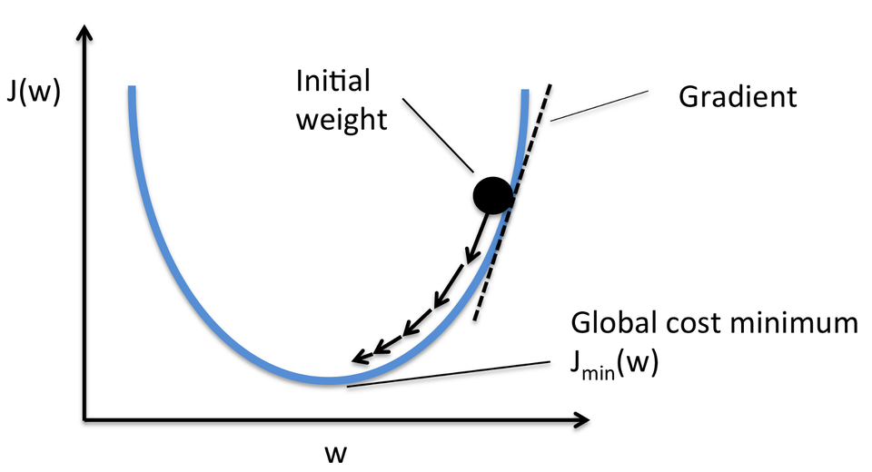
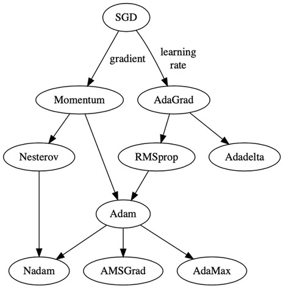
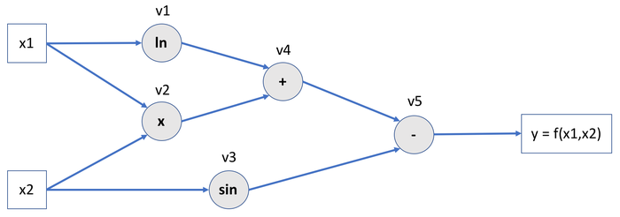
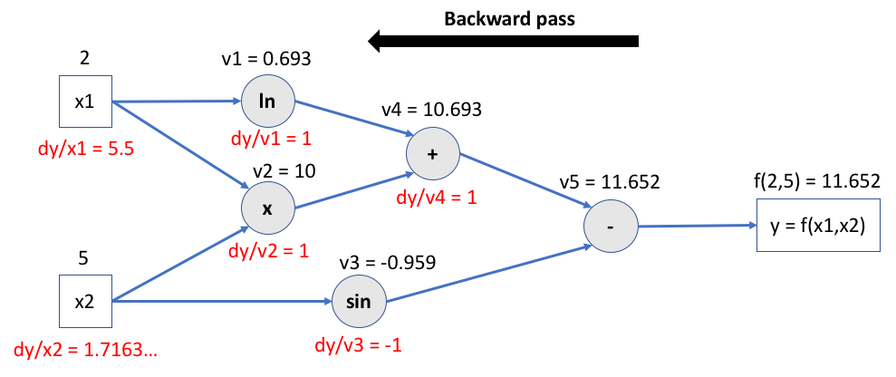

<!-- Apply header and footer to first slide only -->
<!-- _header: "" -->
<!-- _footer: "[Baptiste Pesquet](https://www.bpesquet.fr)" -->

# Learning via Gradient Descent

---

<!-- Show pagination, starting with second slide -->
<!-- paginate: true -->

## Learning objectives

- Understand the gradient descent learning algorithm.
- Learn about its main issues.
- Discover some of the main GD optimization techniques.

---

## The gradient descent algorithm

### An iterative approach

- The model's parameters are iteratively updated until an optimum is reached.
- Each GD iteration combines two steps: computing the gradient of the loss function, then use it to update model parameters.

---

### Step 1: compute gradient of loss function

A **gradient** expresses the variation of a function relative to the variation of its parameters.

$$\nabla_{\pmb{\omega}}\mathcal{L}(\pmb{\omega}) = \begin{pmatrix}
       \ \frac{\partial}{\partial \omega_1} \mathcal{L}(\pmb{\omega}) \\
       \ \frac{\partial}{\partial \omega_2} \mathcal{L}(\pmb{\omega}) \\
       \ \vdots \\
     \end{pmatrix}$$

- $\nabla_{\pmb{\omega}}\mathcal{L}(\pmb{\omega})$: gradient of loss function $\mathcal{L}(\pmb{\omega})$.
- $\frac{\partial}{\partial \omega_i} \mathcal{L}(\pmb{\omega})$: partial derivative of the loss function *w.r.t.* its $i$th parameter.

---

### Step 2: update model parameters

In order to reduce loss for the next iteration, parameters are updated in the **opposite direction** of the gradient.

$$\pmb{\omega_{t+1}} = \pmb{\omega_t} - \eta\nabla_{\pmb{\omega}}\mathcal{L}(\pmb{\omega_t})$$

- $\pmb{\omega_{t}}$: set of parameters at step $t$ of the gradient descent.
- $\pmb{\omega_{t+1}}$: set of parameters at step $t+1$ (after update).
- $\eta$ (sometimes denoted $\alpha$ or $\lambda$): update factor for parameters, called the **_learning rate_**.

---

### Examples

#### 1D gradient descent (one parameter)

---

#### 2D gradient descent (two parameters)

---

#### Dynamics of a 2D gradient descent

---

### Gradient descent types

#### Batch Gradient Descent

The gradient is computed on the whole dataset before model parameters are updated.

- Advantages: simple and safe (always converges in the right direction).
- Drawback: can become slow and even untractable with a big dataset.

---

#### Stochastic Gradient Descent (SGD)

The gradient is computed on only one randomly chosen sample whole dataset before parameters are updated.

- Advantages:
  - Very fast.
  - Enables learning from each new sample (*online learning*).
- Drawback:
  - Convergence is not guaranteed.
  - No vectorization of computations.

---

#### Mini-Batch SGD

The gradient is computed on a small set of samples, called a *batch*, before parameters are updated.

- Combines the advantages of batch and stochastic GD.
- Default method for many ML libraries.
- The mini-batch size varies between 10 and 1000 samples, depending of the dataset size.

---

### Parameters update

#### Impact of learning rate

---

### The local minima problem

---

---

---

### Gradient descent optimization algorithms

#### Gradient descent evolution map

---

#### Momentum

Momentum optimization accelerates the descent speed in the direction of the minimum by accumulating previous gradients. It can also escape plateaux faster then plain GD.

---

##### Momentum equations

$$\pmb{m_{t+1}} = \beta_t \pmb{m_t} - \nabla_{\pmb{\omega}}\mathcal{L}(\pmb{\omega_t})$$

$$\pmb{\omega_{t+1}} = \pmb{\omega_t} + \eta_t\pmb{m_{t+1}}$$

- $\pmb{m_t}$: momentum at step $t$.
- $\beta_t \in [0,1]$: friction factor that prevents gradients updates from growing too large. A typical value is $0.9$.

---

##### Momentum Vs plain GD

---

#### RMSprop

*RMSprop* decays the learning rate differently for each parameter, scaling down the gradient vector along the steepest dimensions. The underlying idea is to adjust the descent direction a bit more towards the global minimum.

$$\pmb{v_{t+1}} = \beta_t \pmb{v_t} + (1-\beta_t) \left(\nabla_{\pmb{\omega}}\mathcal{L}(\pmb{\omega_t})\right)^2$$

$$\pmb{\omega_{t+1}} = \pmb{\omega_t} - \frac{\eta}{\sqrt{\pmb{v_{t}}+\epsilon}}\nabla_{\pmb{\omega}}\mathcal{L}(\pmb{\omega_t})$$

- $\pmb{v_t}$: moving average of squared gradients at step $t$.
- $\epsilon$: smoothing term to avoid divisions by zero. A typical value is $10^{-10}$.

---

#### Adam and other techniques

*Adam* (*Adaptive Moment Estimation*) combines the ideas of momentum and RMSprop. It is the *de facto* choice nowadays.

Gradient descent optimization is a rich subfield of Machine Learning. Read more in [this article](http://ruder.io/optimizing-gradient-descent/).

---

## Gradients computation

### Numerical differentiation

- Finite difference approximation of derivatives.
- Interpretations: instantaneous rate of change, slope of the tangent.
- Generally unstable and limited to a small set of functions.

$$g'(a) = \frac{\partial g(a)}{\partial a} = \lim_{h \to 0} \frac{g(a + h) - g(a)}{h}$$

$$\frac{\partial f(\pmb{x})}{\partial x_i} = \lim_{h \to 0} \frac{f(\pmb{x} + h\pmb{e}_i) - f(\pmb{x})}{h}$$

---

### Symbolic differentiation

- Automatic manipulation of expressions for obtaining derivative expressions.
- Used in modern mathematical software (Mathematica, Maple...).
- Can lead to *expression swell*: exponentially large
symbolic expressions.

$$\frac{\mathrm{d}}{\mathrm{d}x}\left(f(x)+g(x)\right) = \frac{\mathrm{d}}{\mathrm{d}x}f(x)+\frac{\mathrm{d}}{\mathrm{d}x}g(x)$$

$$\frac{\mathrm{d}}{\mathrm{d}x}\left(f(x)g(x)\right) = \left(\frac{\mathrm{d}}{\mathrm{d}x}f(x)\right)g(x)+f(x)\left(\frac{\mathrm{d}}{\mathrm{d}x}g(x)\right)$$

---

### Automatic differentiation (*autodiff*)

- Family of techniques for efficiently computing derivatives of numeric functions.
- Can differentiate closed-form math expressions, but also algorithms using branching, loops or recursion.

### Autodiff and its main modes

- AD combines numerical and symbolic differentiation.
- General idea: apply symbolic differentiation at the elementary operation level and keep intermediate numerical results.
- AD exists in two modes: forward and reverse. Both rely on the **chain rule**.

$$\frac{\mathrm{d}y}{\mathrm{d}x} = \frac{\mathrm{d}y}{\mathrm{d}w_2} \frac{\mathrm{d}w_2}{\mathrm{d}w_1} \frac{\mathrm{d}w_1}{\mathrm{d}x}$$

---

### Forward mode autodiff

- Computes gradients w.r.t. one parameter along with the function output.
- Relies on [dual numbers](https://en.wikipedia.org/wiki/Automatic_differentiation#Automatic_differentiation_using_dual_numbers).
- Efficient when output dimension >> number of parameters.

---

### Reverse mode autodiff

- Computes function output, then do a backward pass to compute gradients w.r.t. all parameters for the output.
- Efficient when number of parameters >> output dimension.

---

#### Example: reverse mode autodiff in action

Let's define the function $f$ of two variables $x_1$ and $x_2$ like so:

$$f(x_1,x_2) = log_e(x_1) + x_1x_2 - sin(x_2)$$

It can be represented as a *computational graph*:

---

##### Step 1: forward pass

Intermediate values are calculated and tensor operations are memorized for future gradient computations.

---

##### Step 2: backward pass

The [chain rule](https://en.wikipedia.org/wiki/Chain_rule) is applied to compute every intermediate gradient, starting from output.

$$y = f(g(x)) \;\;\;\; \frac{\partial y}{\partial x} = \frac{\partial f}{\partial g} \frac{\partial g}{\partial x}\;\;\;\; \frac{\partial y}{\partial x} = \sum_{i=1}^n \frac{\partial f}{\partial g^{(i)}} \frac{\partial g^{(i)}}{\partial x}$$

---

---

$$y=v_5=v_4-v_3$$

$$\frac{\partial y}{\partial v_4}=1\;\;\;\;\frac{\partial y}{\partial v_3}=-1$$

$$v_4=v_1+v_2$$

$$\frac{\partial y}{\partial v_1}=\frac{\partial y}{\partial v_4}\frac{\partial v_4}{\partial v_1}=1\;\;\;\;\frac{\partial y}{\partial v_2}=\frac{\partial y}{\partial v_4}\frac{\partial v_4}{\partial v_2}=1$$

---

$$v_1 = log_e(x_1)\;\;\;\;v_2 = x_1x_2\;\;\;\;v_3 = sin(x_2)$$

$$\frac{\partial v_1}{\partial x_1}=\frac{1}{x_1}\;\;\;\;\frac{\partial v_2}{\partial x_1}=x_2\;\;\;\;\frac{\partial v_2}{\partial x_2}=x_1\;\;\;\;\frac{\partial v_3}{\partial x_2}=cos(x_2)$$

$$\frac{\partial y}{\partial x_1}=\frac{\partial y}{\partial v_1}\frac{\partial v_1}{\partial x_1}+\frac{\partial y}{\partial v_2}\frac{\partial v_2}{\partial x_1}=\frac{1}{x_1}+x_2$$

$$\frac{\partial y}{\partial x_2}=\frac{\partial y}{\partial v_2}\frac{\partial v_2}{\partial x_2}+\frac{\partial y}{\partial v_3}\frac{\partial v_3}{\partial x_2}=x_1-cos(x_2)$$

---

### Autodifferention in practice

Many Machine Learning libraries offer out-of-the-box support for automatic gradients computation. Some prominent ones are currently [TensorFlow](https://www.tensorflow.org/), [PyTorch](https://pytorch.org) and [JAX](https://jax.readthedocs.io).

---

### Differentiable programming

Aka [software 2.0](https://medium.com/@karpathy/software-2-0-a64152b37c35).

> "People are now building a new kind of software by assembling networks of parameterized functional blocks and by training them from examples using some form of gradient-based optimization…. It’s really very much like a regular program, except it’s parameterized, automatically differentiated, and trainable/optimizable" (Y. LeCun).
