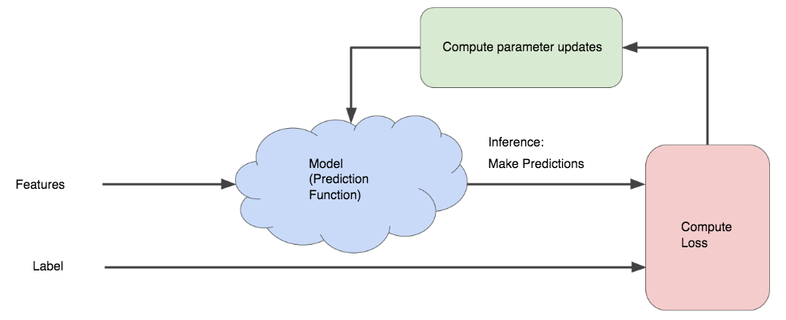
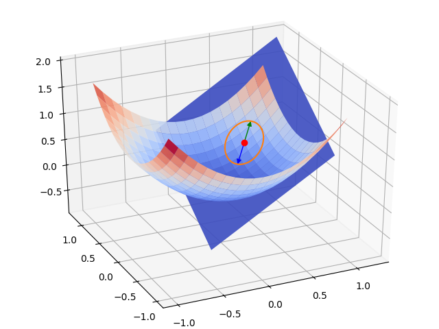
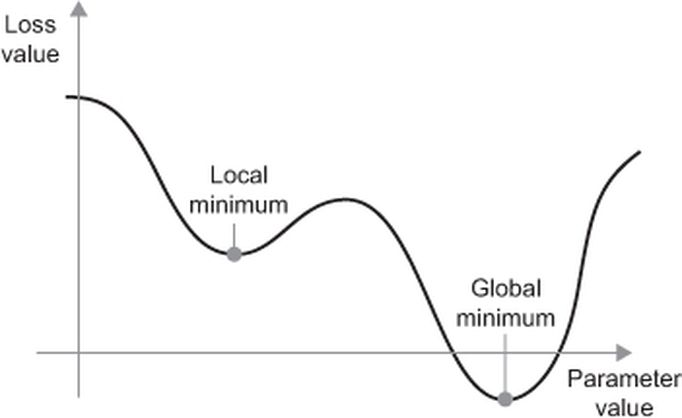
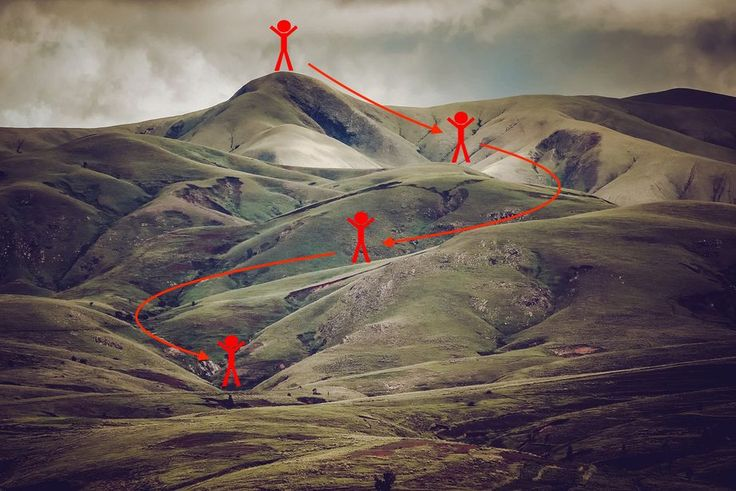

<!-- Apply header and footer to first slide only -->
<!-- _header: "" -->
<!-- _footer: "[Baptiste Pesquet](https://www.bpesquet.fr)" -->

# Learning via Gradient Descent

---

<!-- Show pagination, starting with second slide -->
<!-- paginate: true -->

## Learning objectives

- Understand the gradient descent learning algorithm.
- Learn about its main issues.
- Discover some of the main GD optimization techniques.

---

## The gradient descent algorithm

### An iterative approach

- The model's parameters are iteratively updated until an optimum is reached.
- Each GD iteration combines two steps: computing the gradient of the loss function, then use it to update model parameters.

---

### Step 1: compute gradient of loss function

A **gradient** expresses the variation of a function relative to the variation of its parameters.

$$\nabla_{\pmb{\omega}}\mathcal{L}(\pmb{\omega}) = \begin{pmatrix}
       \ \frac{\partial}{\partial \omega_1} \mathcal{L}(\pmb{\omega}) \\
       \ \frac{\partial}{\partial \omega_2} \mathcal{L}(\pmb{\omega}) \\
       \ \vdots \\
     \end{pmatrix}$$

- $\nabla_{\pmb{\omega}}\mathcal{L}(\pmb{\omega})$: gradient of loss function $\mathcal{L}(\pmb{\omega})$.
- $\frac{\partial}{\partial \omega_i} \mathcal{L}(\pmb{\omega})$: partial derivative of the loss function *w.r.t.* its $i$th parameter.

---

### Step 2: update model parameters

In order to reduce loss for the next iteration, parameters are updated in the **opposite direction** of the gradient.

$$\pmb{\omega_{t+1}} = \pmb{\omega_t} - \eta\nabla_{\pmb{\omega}}\mathcal{L}(\pmb{\omega_t})$$

- $\pmb{\omega_{t}}$: set of parameters at step $t$ of the gradient descent.
- $\pmb{\omega_{t+1}}$: set of parameters at step $t+1$ (after update).
- $\eta$ (sometimes denoted $\alpha$ or $\lambda$): update factor for parameters, called the **_learning rate_**.

---

### Examples

#### 1D gradient descent (one parameter)

---

#### 2D gradient descent (two parameters)

---

#### Dynamics of a 2D gradient descent

---

### Gradient descent types

#### Batch Gradient Descent

The gradient is computed on the whole dataset before model parameters are updated.

- Advantages: simple and safe (always converges in the right direction).
- Drawback: can become slow and even untractable with a big dataset.

---

#### Stochastic Gradient Descent (SGD)

The gradient is computed on only one randomly chosen sample whole dataset before parameters are updated.

- Advantages:
  - Very fast.
  - Enables learning from each new sample (*online learning*).
- Drawback:
  - Convergence is not guaranteed.
  - No vectorization of computations.

---

#### Mini-Batch SGD

The gradient is computed on a small set of samples, called a *batch*, before parameters are updated.

- Combines the advantages of batch and stochastic GD.
- Default method for many ML libraries.
- The mini-batch size varies between 10 and 1000 samples, depending of the dataset size.

---

### Parameters update

#### Impact of learning rate

---

### The local minima problem

---

---

---

### Gradient descent optimization algorithms

#### Gradient descent evolution map

---

#### Momentum

Momentum optimization accelerates the descent speed in the direction of the minimum by accumulating previous gradients. It can also escape plateaux faster then plain GD.

---

##### Momentum equations

$$\pmb{m_{t+1}} = \beta_t \pmb{m_t} - \nabla_{\pmb{\omega}}\mathcal{L}(\pmb{\omega_t})$$

$$\pmb{\omega_{t+1}} = \pmb{\omega_t} + \eta_t\pmb{m_{t+1}}$$

- $\pmb{m_t}$: momentum at step $t$.
- $\beta_t \in [0,1]$: friction factor that prevents gradients updates from growing too large. A typical value is $0.9$.

---

##### Momentum Vs plain GD

---

#### RMSprop

*RMSprop* decays the learning rate differently for each parameter, scaling down the gradient vector along the steepest dimensions. The underlying idea is to adjust the descent direction a bit more towards the global minimum.

$$\pmb{v_{t+1}} = \beta_t \pmb{v_t} + (1-\beta_t) \left(\nabla_{\pmb{\omega}}\mathcal{L}(\pmb{\omega_t})\right)^2$$

$$\pmb{\omega_{t+1}} = \pmb{\omega_t} - \frac{\eta}{\sqrt{\pmb{v_{t}}+\epsilon}}\nabla_{\pmb{\omega}}\mathcal{L}(\pmb{\omega_t})$$

- $\pmb{v_t}$: moving average of squared gradients at step $t$.
- $\epsilon$: smoothing term to avoid divisions by zero. A typical value is $10^{-10}$.

---

#### Adam and other techniques

*Adam* (*Adaptive Moment Estimation*) combines the ideas of momentum and RMSprop. It is the *de facto* choice nowadays.

Gradient descent optimization is a rich subfield of Machine Learning. Read more in [this article](http://ruder.io/optimizing-gradient-descent/).
