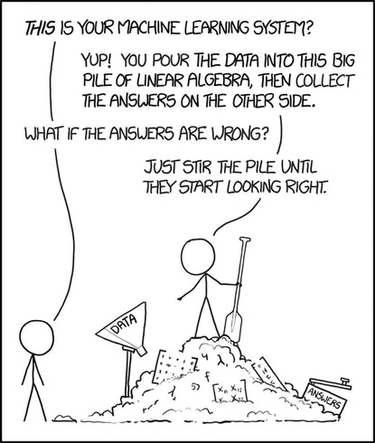
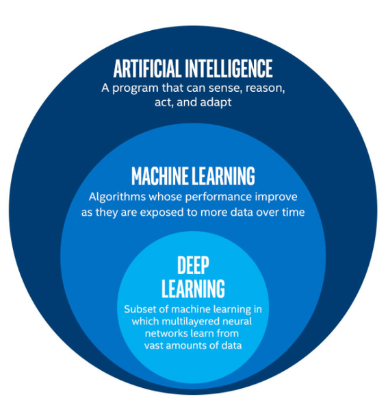
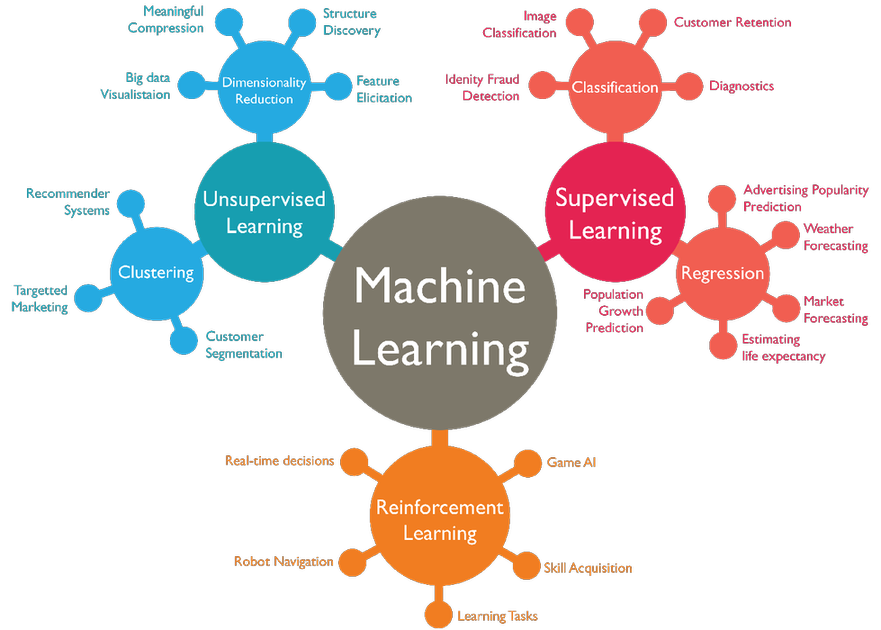
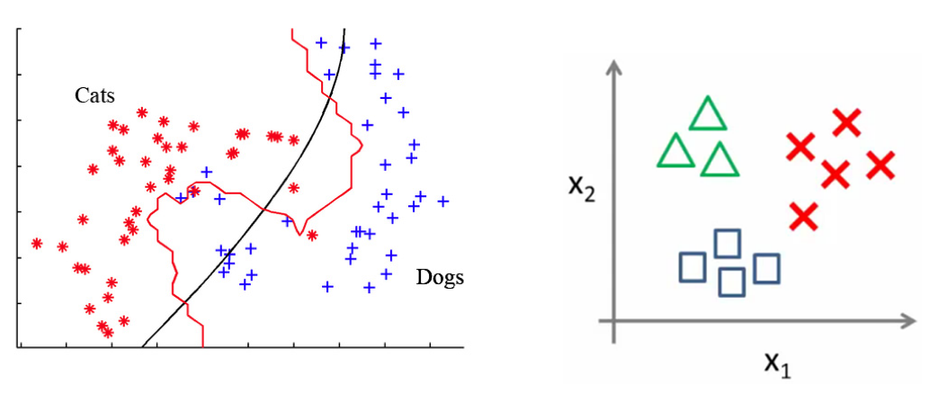
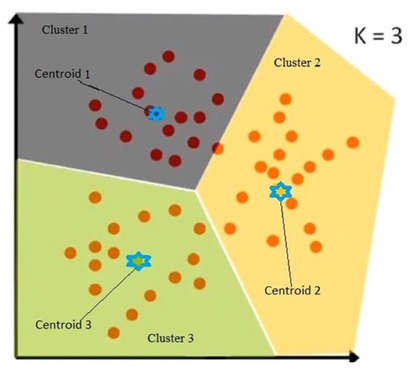
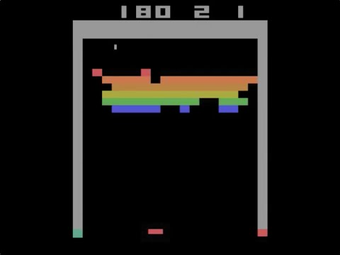
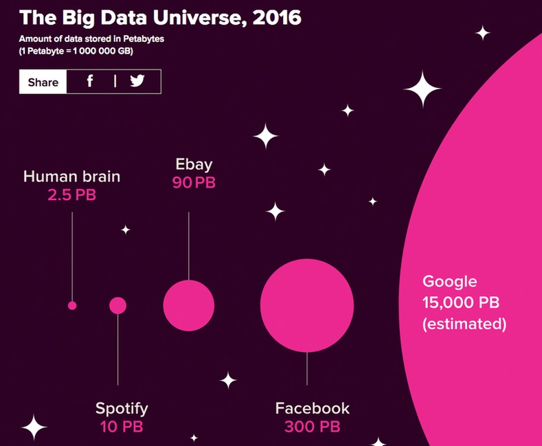

<!-- Apply header and footer to first slide only -->
<!-- _header: "[](https://www.bordeaux-inp.fr)" -->
<!-- _footer: "[Baptiste Pesquet](https://www.bpesquet.fr)" -->

# Machine Learning: an introduction

---

## Learning objectives

- Know what Machine Learning and Deep Learning are about.
- Understand the main categories of ML systems.
- Discover some of the many existing ML algorithms.

---

## Whats is Machine Learning?

---

### The first definition of Machine Learning

> "The field of study that gives computers the ability to learn without being explicitly programmed." (Arthur Samuel, 1959).

---

### Machine Learning in a nutshell

Set of techniques for giving machines the ability to to find **patterns** and extract **rules** from data, in order to:

- **Identify** or **classify** elements.
- Detect **tendencies**.
- Make **predictions**.

As more data is fed into the system, results get better: performance improves with experience.

a.k.a. **Statistical Learning**.

---

### A new paradigm...


---

### ... Or merely a bag of tricks?

[](https://xkcd.com/1838/)

---

## The Machine Learning landscape

---

### AI, Machine Learning and Deep Learning



---

### Typology of ML systems

ML systems are traditionally classified in three categories, according to the amount and type of human supervision during training. [Hybrid approaches](https://hackernoon.com/self-supervised-learning-gets-us-closer-to-autonomous-learning-be77e6c86b5a) exist.

- **Supervised Learning**: expected results (called *labels* or *tags*) are given to the system along with training data.
- **Unsupervised Learning**: training data comes without the expected results. The system must discover some structure in the data by itself.
- **Reinforcement Learning**: without being given an explicit goal, the system's decisions produce a **reward** it tries to maximize.

---



---

### Regression

The system predicts **continuous** values. Examples: temperature forecasting, asset price prediction...


---

### Classification

The system predicts **discrete** values: input is **categorized**.



---

### Classification types

- **Binary**: only two possibles classes. Examples: cat/not a cat, spam/legit mail, benign/malignant tumor.
- **Multiclass**: several mutually exclusive classes. Example: handwritten digit recognition.
- **Multilabel**: several non-mutually exclusive classes. Example: face recognition.

---

### Clustering

Data is partitioned into groups.



---

### Anomaly Detection

The system is able to detect abnomal samples (*outliers*).


---

### Game AI

[](https://www.youtube.com/embed/TmPfTpjtdgg)

---

## How do machines learn, actually?

---

### Algorithm #1: K-Nearest Neighbors

Prediction is based on the `k` nearest neighbors of a data sample.

[](https://en.wikipedia.org/wiki/K-nearest_neighbors_algorithm)

---

### Algorithm #2: Decision Trees

Build a tree-like structure based on a series of discovered questions on the data.


---

### Algorithm #3: Neural Networks

Layers of loosely neuron-inpired computation units that can approximate any continuous function.


---


---

## The advent of Deep Learning

---

### The Deep Learning tsunami

DL is a subfield of Machine Learning consisting of multilayered neural networks trained on vast amounts of data.

[](https://papers.nips.cc/paper/4824-imagenet-classification-with-deep-convolutional-neural-networks.pdf)

Since 2010, DL-based approaches outperformed previous state-of-the-art techniques in many fields (language translation, image and scene recognition, and [much more](https://huggingface.co/spaces/akhaliq/AnimeGANv2)).

---

### Reasons for success

- Explosion of available data.
- Huge progress in computing power.
- Refinement of many existing algorithms.
- Availability of sophisticated tools for building ML-powered systems.


---



---


---

### From labs to everyday life in 25 years

[](http://yann.lecun.com/exdb/lenet/)

[](https://twitter.com/mbrennanchina/status/1203687857849716736)

```python

```
