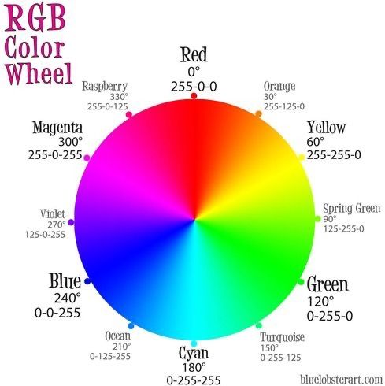

<!-- Apply header and footer to first slide only -->
<!-- _header: "" -->
<!-- _footer: "[Baptiste Pesquet](https://www.bpesquet.fr)" -->

# Recognize handwritten digits

---

<!-- Show pagination, starting with second slide -->
<!-- paginate: true -->

## Learning objectives

- Discover how to train a Machine Learning model on bitmap images.
- Understand how loss and model performance are evaluated in classification tasks.
- Discover several performance metrics and how to choose between them.

---

## Context and data preparation

### The MNIST handwritten digits dataset

This [dataset](http://yann.lecun.com/exdb/mnist/), a staple of Machine Learning and the "Hello, world!" of computer vision, contains 70,000 bitmap images of digits.

The associated label (expected result) for any image is the digit its represents.

---

### Dataset loading

Many Machine Learning librairies include this dataset as a benchmark for training models. Notable examples include [PyTorch](https://pytorch.org/vision/main/generated/torchvision.datasets.MNIST.html) and [Keras](https://keras.io/api/datasets/mnist/).

It is also possible to retrieve this dataset from several online sources, like for example [openml.org](https://openml.org/search?type=data&status=active&id=554). The scikit-learn [fetch_openml](https://scikit-learn.org/stable/modules/generated/sklearn.datasets.fetch_openml.html) function facilitates this task.

---

### Dataset splitting

Data preparation begins with splitting the dataset between training and test sets. A common practice is to set apart 10,000 images for the test set.

---

### Data preprocessing

#### Dealing with images

Digital images are stored using either the bitmap format (color values for all individual pixels in the image) or the vector format (a description of the elementary shapes in the image).

Bitmap images can be easily manipulated as tensors. Each pixel color is typically expressed using a combination of the three primary colors (red, green and blue), with an integer value between $0$ and $255$ for each one.

For grayscale bitmap images like those of the MNIST dataset, each pixel has only one integer value between $0$ and $255$.

---

---
